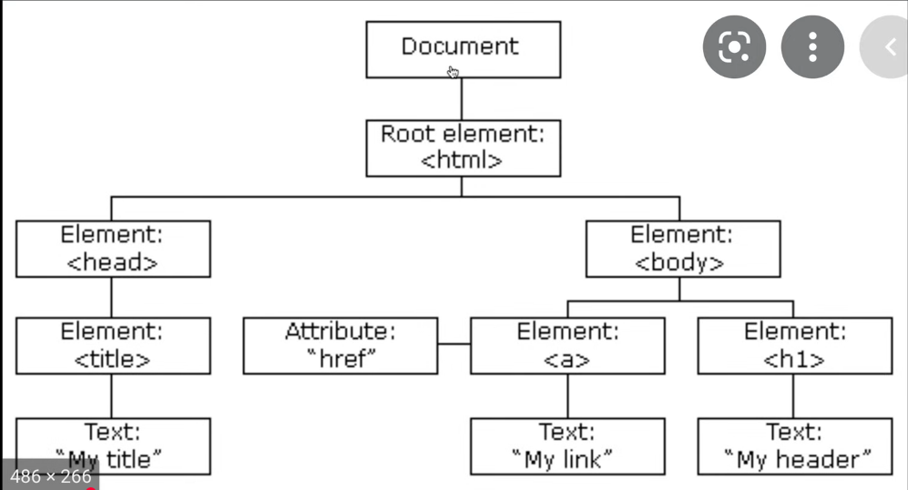

# document.createElement

# React.CreateElemet
- import thẳng vào html:
  ``
- Import react vào project
# ReactDOM
- ``

1. Tạo sao sử dụng React-DOM
 - Để render các React element ra trình duyệt
 - Là cầu nối của React tạo ra react Element và có thể render ra DOM
2. Tại sao tách React-DOM
  - Khi Native ra đời thì ng ta tách ra React-DOM và React ra để dễ xử lý
  - React-Native: Là cầu nối giữa React và Native (mobile tablet)
  - React-DOM: Là cầu nối giữa React và DOM (website)

# JSX - Javascript XML
JSX: Cú pháp mở rộng của xml

## Tại sao sử dụng JSX
Vì rất nhiều đối số để sử dụng trong React.createElement
- JSX linh động, truyền đan xem code Javascript vào giữa

## JSX không phải là html
- Cần có Javascript, Babel để dùng JSX
- Babel chuyển đổi JSX sang cú pháp React hiểu được

## JSX và React-DOM
- Cài babel: ``