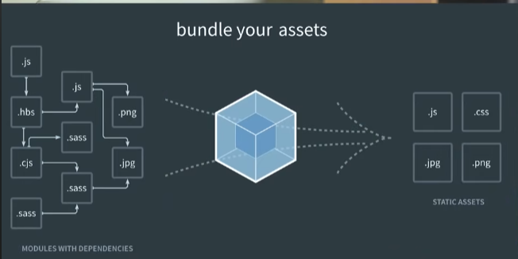

# NodeJS
- Là một javascript runtime
- Runtime: Môi trường độc lập thực thi code javascript, không liên quan gì tới trình duyệt
- Để NodeJS chạy được JS thì bên nó đang  sử dụng Chrome V8 Javascript Engine (Phát triển Google)
  - Trình duyệt Chrome cũng sài lõi vậy

## Sử dụng NodeJS trong FrontEnd
- Dùng Node JS dùng để tạo ra 1 máy chủ web chạy trên máy tính.
- Tránh lặp đi lặp lại các thao tác như:
  - Link React, ReactDOM, Babel
- Hệ sinh thái của Node có rất nhiều thư viện giải quyết
- Cài node -> Cài NPM 
  - Không cần dùng thẻ script để link mà chỉ cần import sử dụng
- Facebook tạo sẵn thư viện Create-React-App
  - Làm sẵn hết
  - Cài sẵn webpack, react, react dom, babel,...
  - Webpack
  
    - Giúp module hoá mọi thứ làm việc với Frontend
    - Có thể import và export tất cả các file
